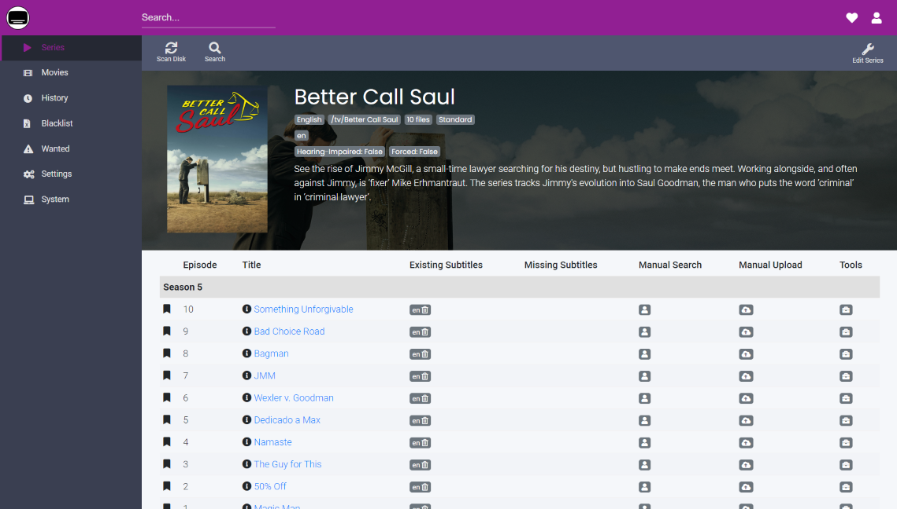

<!--
Ohart ongi: README hau automatikoki sortu da <https://github.com/YunoHost/apps/tree/master/tools/readme_generator>ri esker
EZ editatu eskuz.
-->

# Bazarr YunoHost-erako

[](https://ci-apps.yunohost.org/ci/apps/bazarr/)  

[](https://install-app.yunohost.org/?app=bazarr)

*[Irakurri README hau beste hizkuntzatan.](./ALL_README.md)*

> *Pakete honek Bazarr YunoHost zerbitzari batean azkar eta zailtasunik gabe instalatzea ahalbidetzen dizu.*  
> *YunoHost ez baduzu, kontsultatu [gida](https://yunohost.org/install) nola instalatu ikasteko.*

## Aurreikuspena

Bazarr is a companion application to Sonarr and Radarr that manages and downloads subtitles based on your requirements.

### Features

- Automatic search as soon as subtitles are available in your language
- Manual search for picking them yourself
- Subtitles upgrade whenever better ones are released


**Paketatutako bertsioa:** 1.4.4~ynh1

## Pantaila-argazkiak



## Dokumentazioa eta baliabideak

- Aplikazioaren webgune ofiziala: <https://bazarr.media>
- Administratzaileen dokumentazio ofiziala: <https://wiki.bazarr.media>
- Jatorrizko aplikazioaren kode-gordailua: <https://github.com/morpheus65535/bazarr>
- YunoHost Denda: <https://apps.yunohost.org/app/bazarr>
- Eman errore baten berri: <https://github.com/YunoHost-Apps/bazarr_ynh/issues>

## Garatzaileentzako informazioa

Bidali `pull request`a [`testing` abarrera](https://github.com/YunoHost-Apps/bazarr_ynh/tree/testing).

`testing` abarra probatzeko, ondorengoa egin:

```bash
sudo yunohost app install https://github.com/YunoHost-Apps/bazarr_ynh/tree/testing --debug
edo
sudo yunohost app upgrade bazarr -u https://github.com/YunoHost-Apps/bazarr_ynh/tree/testing --debug
```

**Informazio gehiago aplikazioaren paketatzeari buruz:** <https://yunohost.org/packaging_apps>
